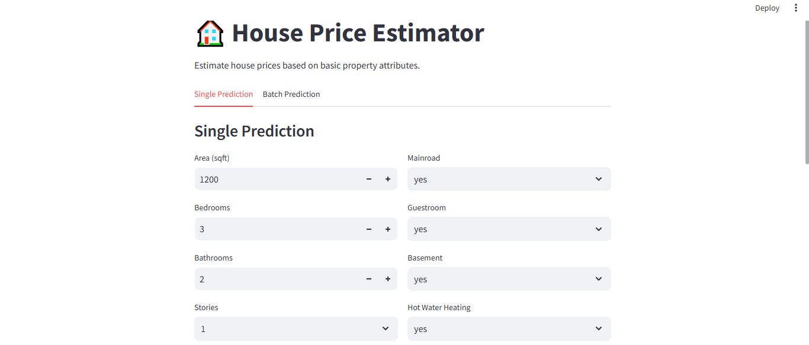
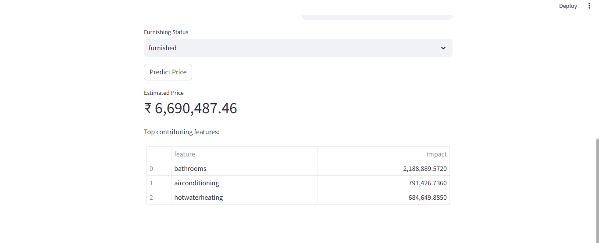

📘 House Price Prediction – End-to-End ML Application

A deployed machine learning system that predicts residential property prices based on key structural and amenity features.
This project includes a trained ML model, a consistent preprocessing pipeline, and two deployment layers:

🌀 Backend API (FastAPI) → hosted on Render

🖥 Interactive UI (Streamlit) → local or cloud-hosted

🚀 Live API Endpoint

👉 https://ml-house-price-api.onrender.com/

Available routes:

/predict – single prediction (POST)

/batch_predict – batch scoring (POST)

/health – health check

/metadata – model details

You can test the API via:

curl -X POST "https://ml-house-price-api.onrender.com/predict" \
     -H "Content-Type: application/json" \
     -d "{\"area\":1200,\"bedrooms\":3,\"bathrooms\":2,\"stories\":1,\"mainroad\":\"yes\",\"guestroom\":\"no\",\"basement\":\"no\",\"hotwaterheating\":\"no\",\"airconditioning\":\"yes\",\"parking\":1,\"prefarea\":\"yes\",\"furnishingstatus\":\"furnished\"}"

🎯 Project Overview

The goal is to estimate the market price of a house using a set of numerical and categorical housing attributes.
The system is fully reproducible and includes:

Preprocessing + encoding aligned for training and inference

Model comparison (Linear Regression vs RandomForest)

Hyperparameter tuning

Exported artifacts: trained model + feature columns

Deployed API + Streamlit frontend

Lightweight feature contribution explanations

🧠 Model Development Workflow
1. Data Preparation

Mapped yes/no fields → binary

One-hot encoded furnishing status

Ensured consistent input schema using stored column order

Train/test split with reproducible seed

2. Model Training

Models evaluated:

Linear Regression (baseline)

RandomForestRegressor with RandomizedSearchCV tuning

The model with the best RMSE was exported as the production model (linear_regression_model.pkl or RF depending on results).

3. Exported Artifacts

linear_regression_model.pkl

model_columns.pkl

These are used by both the API and the Streamlit app.

🛠️ Tech Stack

FastAPI – production-grade API for serving predictions

Streamlit – interactive UI for demos and exploration

scikit-learn – model training and evaluation

Pandas – preprocessing

Render – cloud deployment for backend

Joblib – artifact serialization

📡 Deploying on Render (Backend API)

The backend consists of:

house_api.py

requirements.txt

Saved model artifacts

Deployment flow:

Push repo to GitHub

Create new Web Service on Render

Select Python environment

Set Start Command to:

uvicorn house_api:app --host 0.0.0.0 --port 10000

Add environment variables if needed (optional)

Render auto-builds and deploys

The app is now live at:
👉 https://ml-house-price-api.onrender.com/

🖥 Streamlit Demo App

Streamlit provides an interactive UI for:

entering custom house parameters

generating predictions

viewing top contributing features

uploading CSVs for batch scoring

Run locally:
pip install -r requirements.txt
streamlit run app.py

📄 Example Input (JSON)
{
  "area": 1200,
  "bedrooms": 3,
  "bathrooms": 2,
  "stories": 1,
  "mainroad": "yes",
  "guestroom": "no",
  "basement": "no",
  "hotwaterheating": "no",
  "airconditioning": "yes",
  "parking": 1,
  "prefarea": "yes",
  "furnishingstatus": "furnished"
}

📊 Batch Prediction

Upload a CSV with the same columns, and the app/API will return predictions with an additional predicted_price column.

🔍 Interpretability

The API & UI include a lightweight explanation module based on:

model coefficients (for linear models)

feature importances (for tree-based models)

This surfaces the top contributing features for each prediction.

## Screenshots

### Correlation Heatmap

### Example Prediction

### Streamlit UI

### Streamlit UI 2

### Swagger UI

🌱 Future Enhancements

SHAP-based model explanations

Docker-based deployment for portability

Integration with React frontend (optional)

Model monitoring & drift detection

CI/CD workflow for automated deployments

✨ Summary

This project showcases:

Building an ML model end-to-end

Designing preprocessing compatible with deployment

Shipping a real API used by external clients

Creating a user-facing interface

Hosting a fully working ML system in the cloud

A strong example of taking a concept from notebook → model → API → deployed app.
